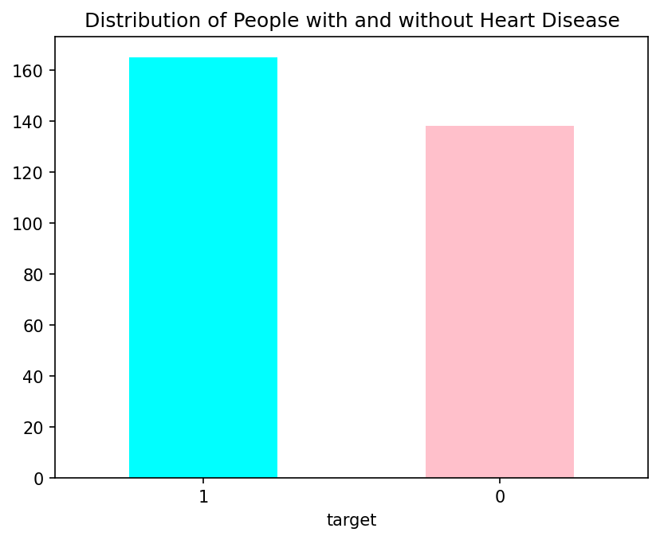
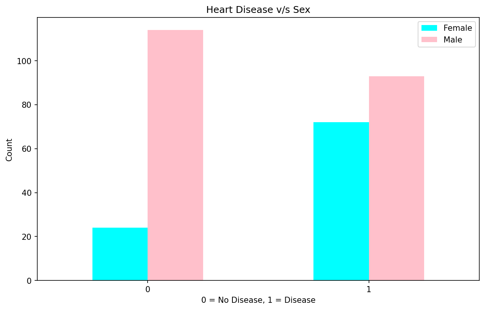
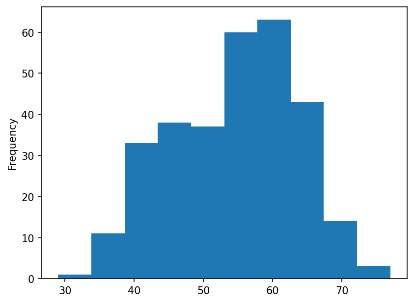
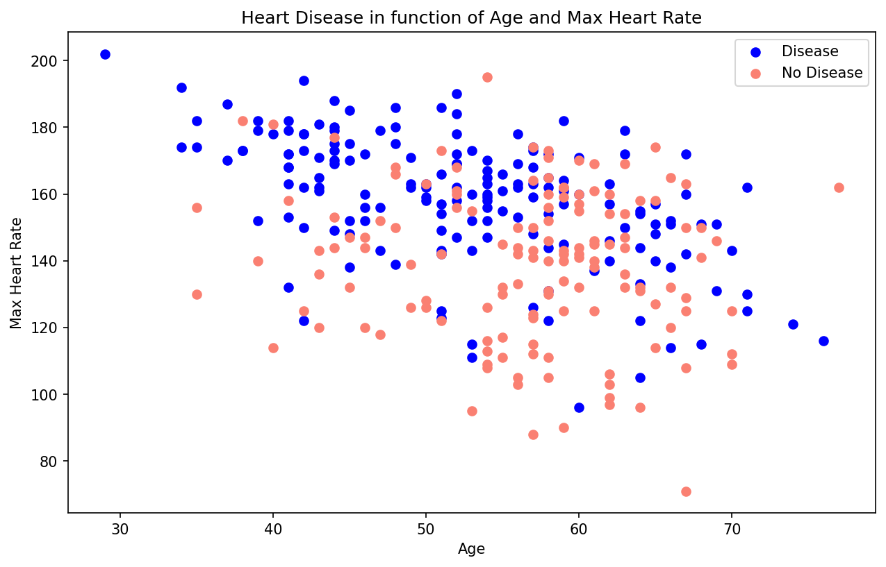
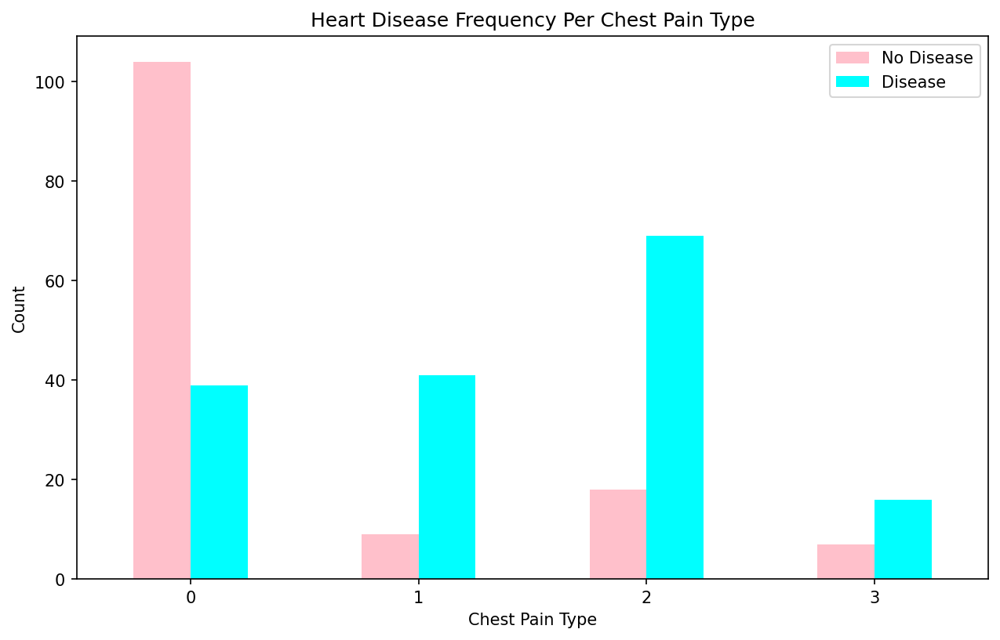
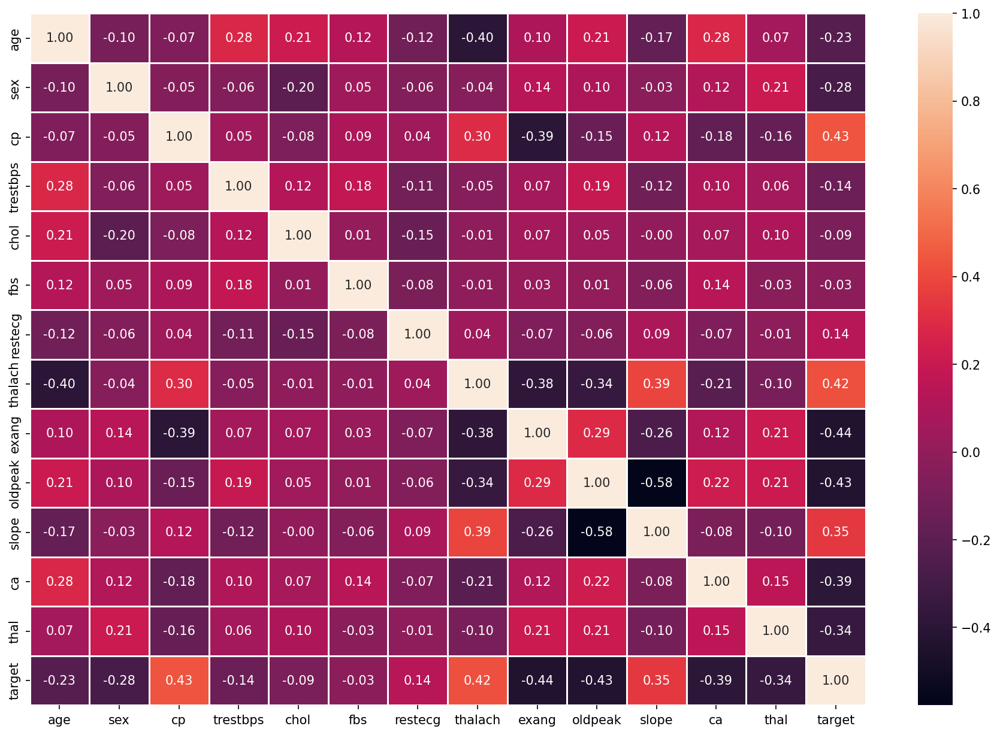
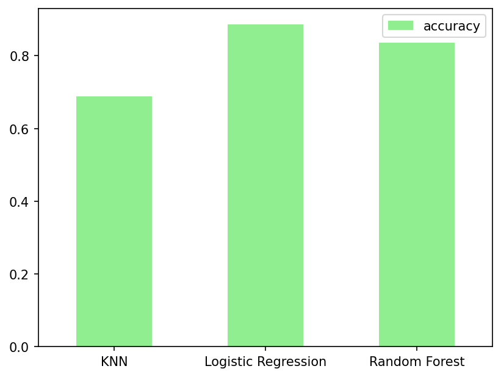

# Heart Disease Prediction

Predicting the likelihood of heart disease based on clinical metrics using machine learning classification models.
- Dataset link: https://www.kaggle.com/datasets/dkwarkaggle/heart-disease-rate

## Models Used
- Logistic Regression (baseline)
- Random Forest Classifier
- K-Nearest Neighbors (KNN)

## Results
| Model | Accuracy |
|---|---|
| Logistic Regression |  0.885 |
| Random Forest |  0.836 |
| K-Nearest Neighbors |  0.688 |

## Key Steps
- **Data Loading**: Imported the `heart-disease-rate.csv` dataset containing 303 patient records and 14 clinical features.
- **Exploratory Data Analysis (EDA)**: Analyzed feature distributions, cross-tabulations, and core relationships using visualization libraries.
- **Model Training**: Split the data into train/test sets and trained three distinct classifiers.
- **Evaluation**: Compared models using baseline accuracy scores to identify the most reliable predictor.

## Plots & Interpretations

**Target Distribution**: Displays the count of patients with and without heart disease, showing whether the dataset is balanced.

**Heart Disease vs. Sex**: Illustrates the prevalence of heart disease separated by gender, highlighting potential demographic trends.

**Age Distribution**: A histogram outlining the age range of the patients in the dataset to understand the primary demographic.

**Age and Max Heart Rate**: A scatter plot comparing age against maximum heart rate achieved, colored by heart disease status to spot clusters or patterns.

**Chest Pain Type**: Breaks down the frequency of heart disease diagnoses based on the specific type of chest pain reported.

**Correlation Heatmap**: A matrix showing the correlation coefficients between all numerical features. Useful for spotting which clinical traits are strongly tied to the target or to each other.

**Model Comparison**: A bar chart visualizing the final accuracy scores of the three models. Logistic Regression clearly leads the pack.

## Tech Stack
Python · scikit-learn · pandas · matplotlib · seaborn
